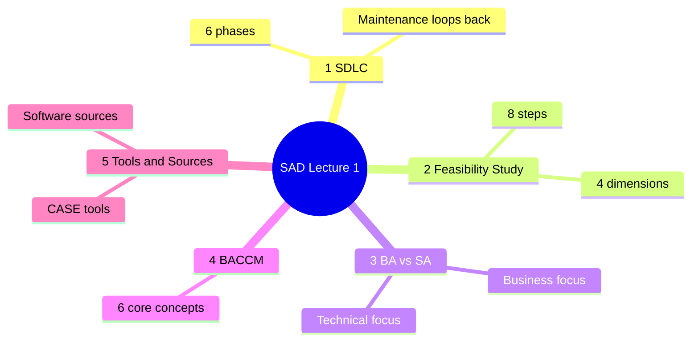
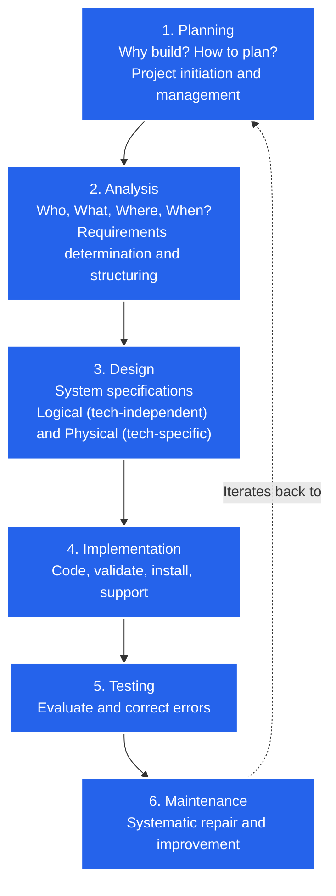
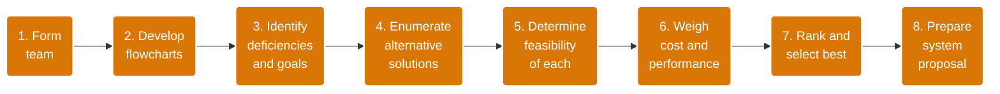
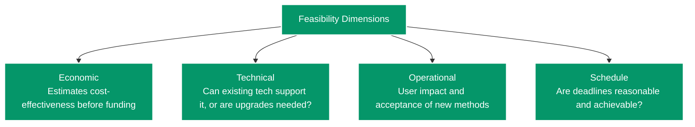
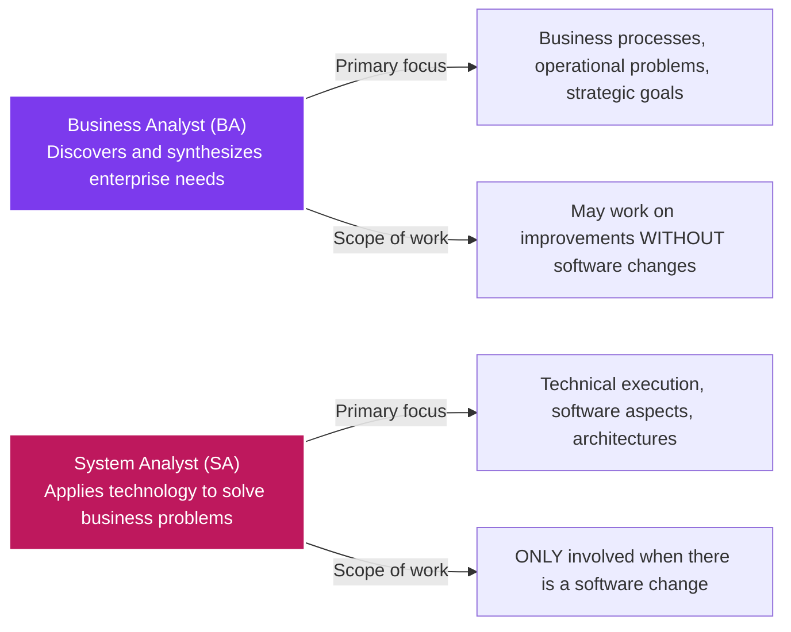
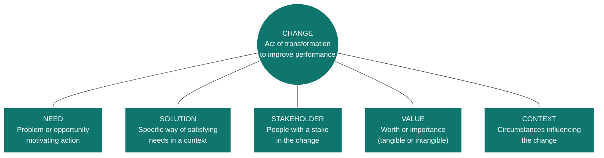
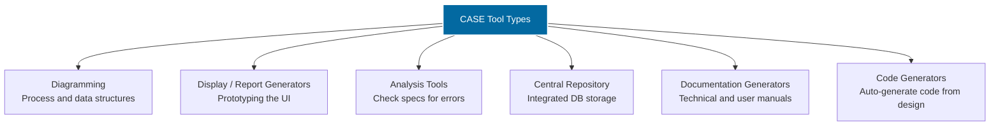
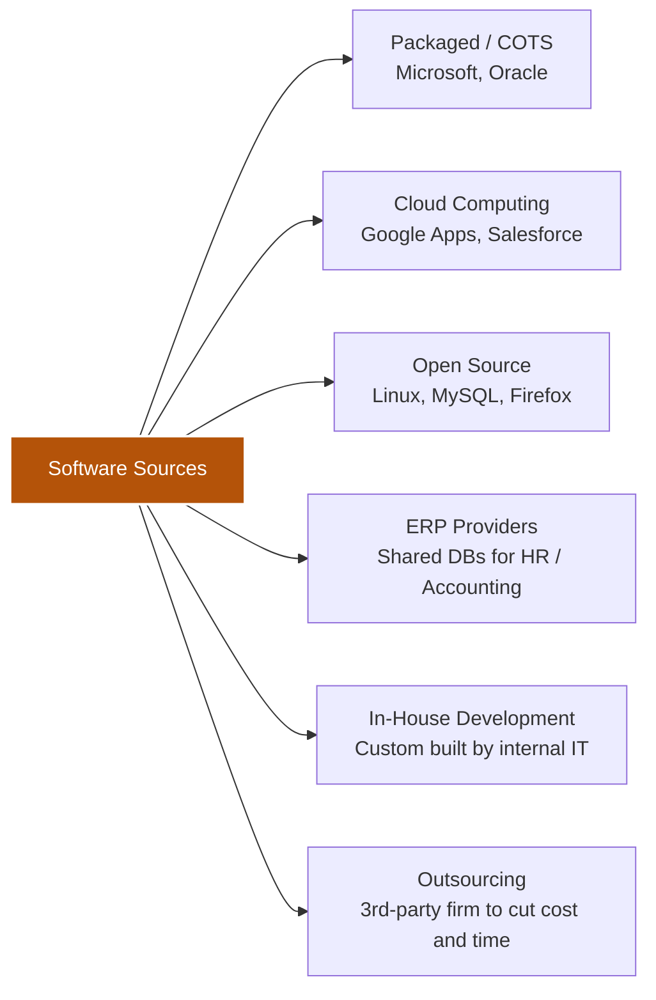

# Systems Analysis & Design (SAD) — Lecture 1
**Faculty:** Faculty of Computer and Information Sciences, Ain Shams University (FCIS ASU)

---

## Table of Contents

1. [SDLC](#1-systems-development-life-cycle-sdlc)
2. [Feasibility Study](#2-feasibility-study--analysis)
3. [Business Analyst vs. System Analyst](#3-business-analysis-vs-system-analysis)
4. [BACCM](#4-business-analysis-core-concept-model-baccm)
5. [CASE Tools & Software Sources](#5-case-tools--software-sources)
6. [Quick Memory Cheat Sheet](#6-quick-memory-cheat-sheet)

---

## Visual Concept Map (Lecture Overview)

---

## 1. Systems Development Life Cycle (SDLC)

> **Definition:** The traditional, orderly methodology used to develop, maintain, and replace information systems. It yields working software, system documentation, and user training.

*Note: Maintenance is not a separate linear phase. It is a repetition of the other life cycle phases.*

| Phase | Key question / activity |
|---|---|
| Planning | Why build the system? How should the team plan it? |
| Analysis | Who uses it, what does it do, where and when is it used? |
| Design | Logical design (technology-independent) then Physical design (technology-specific) |
| Implementation | Code, validate, install, support |
| Testing | Evaluate and correct errors |
| Maintenance | Repair and improve, by repeating the earlier phases |

---

## 2. Feasibility Study & Analysis

> **Purpose:** A preliminary investigation that helps management decide whether development is viable. It gathers the problem outline and scope (**not** the solution) and outputs a formal **system proposal**.

### The 8 Steps of Feasibility Analysis

**Grouping trick:** the 8 steps fall into three blocks:
- **Understand** (steps 1-3): team, flowcharts, deficiencies and goals
- **Explore** (steps 4-5): alternatives, feasibility of each
- **Decide** (steps 6-8): weigh, rank, write the proposal

### The 4 Core Feasibility Dimensions

---

## 3. Business Analysis vs. System Analysis

> **Core skill categories (System Analyst):** Technical, business, analytical, interpersonal, management, and ethical.

| | Business Analyst | System Analyst |
|---|---|---|
| Role | Discovers and synthesizes enterprise needs | Applies technology to solve business problems |
| Focus | Business processes, operational problems, strategic goals | Technical execution, software, architectures |
| Scope | Can improve things without any software change | Only involved when software changes |

---

## 4. Business Analysis Core Concept Model (BACCM)

Six core concepts. Read them as one sentence: a **Change** is triggered by a **Need**, satisfied by a **Solution**, for **Stakeholders**, creating **Value**, within a **Context**.

**Key details**
- **Stakeholders include:** customers, end users, project managers, regulators, suppliers, sponsors, testers.
- **Value:** *Tangible* (monetary, measurable) or *Intangible* (morale, reputation).
- **Context:** circumstances that influence the change (culture, demographics, technology, weather).

---

## 5. CASE Tools & Software Sources

### CASE Tools (Computer-Aided Software Engineering)

> Software that supports SDLC activities. It uses an integrated database called the **Central Repository** for specifications, diagrams, reports, and project information (e.g., Oracle Designer, Rational Rose).

### Sources of Application Software

| Source | Example | One-line idea |
|---|---|---|
| Packaged / COTS | Microsoft, Oracle | Buy ready-made software |
| Cloud | Google Apps, Salesforce | Rent it online |
| Open source | Linux, MySQL, Firefox | Free, community-built code |
| ERP | HR / Accounting systems | One shared DB across the company |
| In-house | Built by internal IT | Custom, full control |
| Outsourcing | 3rd-party firm | Hire someone else to build it |

---

## 6. Quick Memory Cheat Sheet

| Topic | Remember this |
|---|---|
| SDLC (6 phases) | **P**lanning → **A**nalysis → **D**esign → **I**mplementation → **T**esting → **M**aintenance ("PADITM"), and Maintenance loops back |
| Design types | Logical = tech-independent, Physical = tech-specific |
| Feasibility output | A formal **system proposal** (problem scope, not the solution) |
| Feasibility steps | Understand (1-3) → Explore (4-5) → Decide (6-8) |
| 4 dimensions | **E**conomic, **T**echnical, **O**perational, **S**chedule ("ETOS") |
| BA vs SA | BA = business needs, may change no software. SA = technology, only with software change |
| SA skills | Technical, business, analytical, interpersonal, management, ethical |
| BACCM | Change, Need, Solution, Stakeholder, Value, Context |
| CASE tools | Diagramming, Display/Report, Analysis, Central Repository, Documentation, Code generators |
| Software sources | Packaged, Cloud, Open source, ERP, In-house, Outsourcing |
