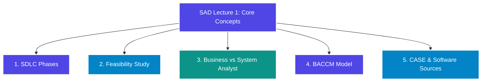
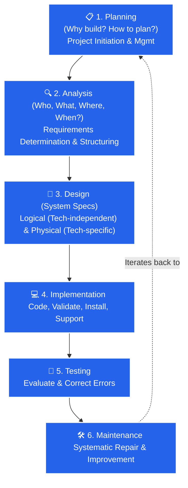
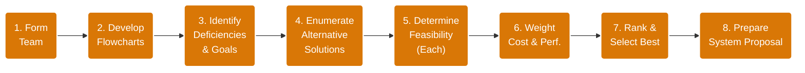
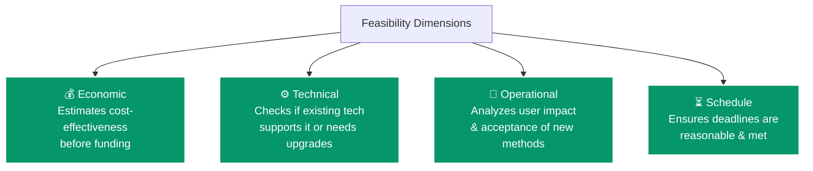
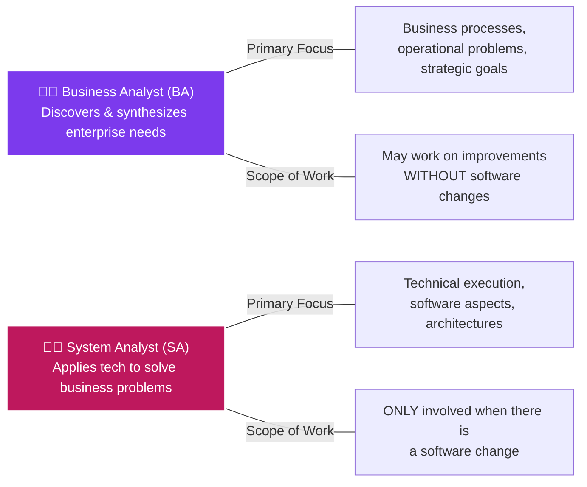
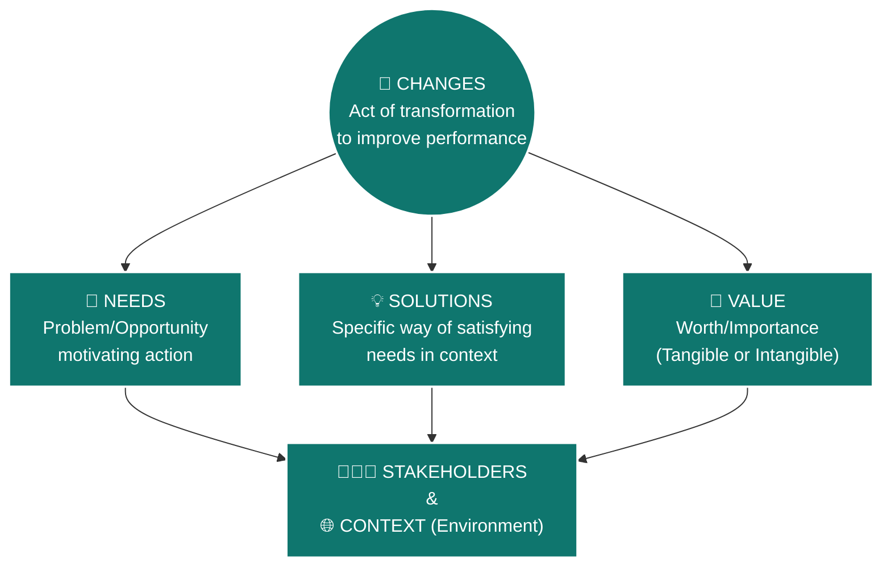
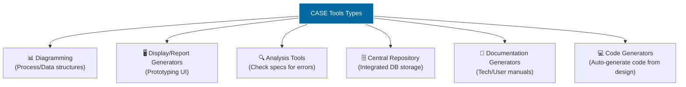
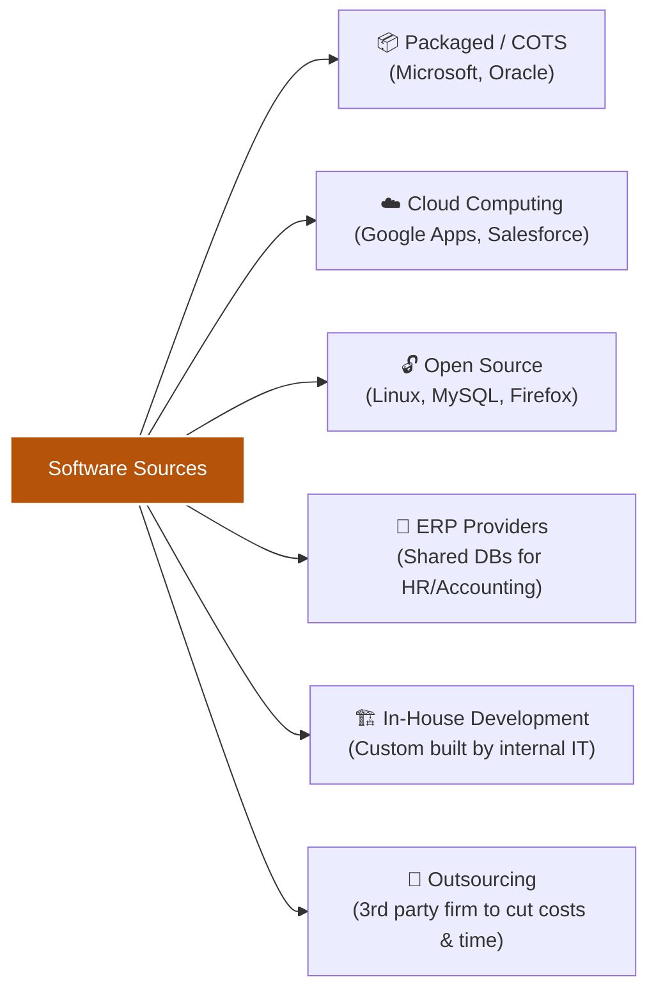

# Systems Analysis & Design (SAD) — Lecture 1
**Faculty:** Faculty of Computer and Information Sciences, Ain Shams University (FCIS ASU)  

---

## Visual Concept Map (Lecture Overview)

---

## 1. 🔵 Systems Development Life Cycle (SDLC)

> **Definition:** The traditional, orderly methodology to develop, maintain, and replace information systems. Yields working software, system documentation, and user training.

*(Note: Maintenance is not a separate linear phase, but a repetition of the other life cycle phases).*

---

## 2. 🟡 Feasibility Study & Analysis

> **Purpose:** A preliminary investigation to help management decide if development is viable. Acquires problem outline/scope (not the solution) to output a formal system proposal.

### 🧭 The 8 Steps of Feasibility Analysis

### 🎯 The 4 Core Feasibility Dimensions

---

## 3. 💼 Business Analysis vs. System Analysis

> **Core Skill Categories (SA):** Technical, business, analytical, interpersonal, management, and ethical.

---

## 4. 🎯 Business Analysis Core Concept Model (BACCM)

**Key Details:**
*   **Stakeholders include:** Customers, end users, project managers, regulators, suppliers, sponsors, testers.
*   **Value:** Can be *Tangible* (monetary, measurable) or *Intangible* (morale, reputation).
*   **Context:** Circumstances influencing the change (culture, demographics, tech, weather).

---

## 5. 🛠️ CASE Tools & Software Sources

### 🧰 CASE Tools (Computer-Aided Software Engineering)
> Software supporting SDLC activities. Uses an integrated database called a **Central Repository** for specs, diagrams, reports, and project info (e.g., Oracle Designer, Rational Rose).

### 💿 Sources of Application Software

