# Systems Analysis & Design — Project Planning
**Faculty:** Faculty of Computer and Information Sciences, Ain Shams University (FCIS ASU)

---

## Table of Contents

1. [Planning Stages](#1-project-planning-stages--overview)
2. [Software Pricing](#2-software-pricing--factors)
3. [Plan-Driven Development](#3-plan-driven-development--project-plans)
4. [Iterative Planning Flow](#4-the-iterative-planning-process)
5. [Project Scheduling](#5-project-scheduling)
6. [Activity Network & Critical Path](#6-activity-network-diagram--critical-path)
7. [Time Estimation](#7-time-estimation--expected-time-formula)
8. [ASU Career Week](#8-ain-shams-university-career-week-asu-cw-25)
9. [Quick Memory Cheat Sheet](#9-quick-memory-cheat-sheet)

---

## Visual Concept Map (Lecture Overview)

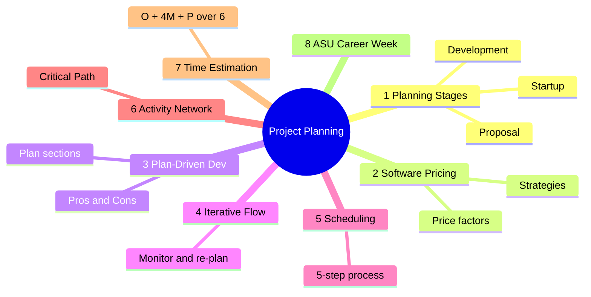

---

## 1. Project Planning Stages & Overview

**Core purpose:** Break work into parts, assign team members, anticipate problems, and communicate how the work will be done to the team and the customer. The plan is created at project start and used to assess progress.

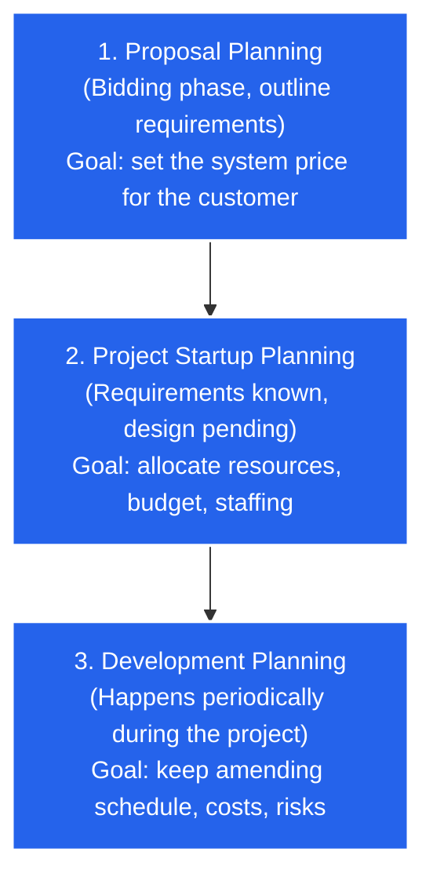

---

## 2. Software Pricing & Factors

**Overview:** Price starts from the cost of production (hardware, software, travel, training, effort), but organizational, economic, political and business considerations influence the final price charged.

### Pricing Strategies

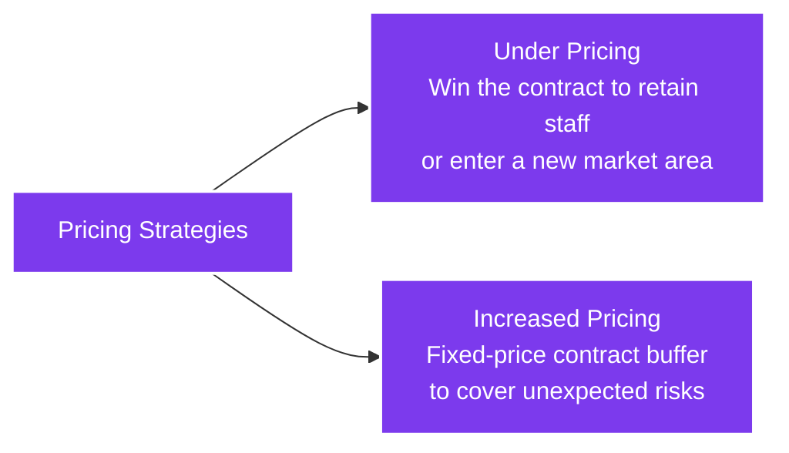

### Factors Affecting Software Price

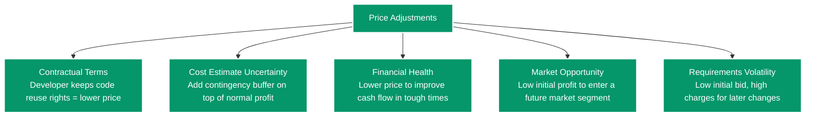

---

## 3. Plan-Driven Development & Project Plans

**Definition:** The traditional approach to managing large projects, using a detailed plan that records the work, schedules, and work products.

### Pros and Cons

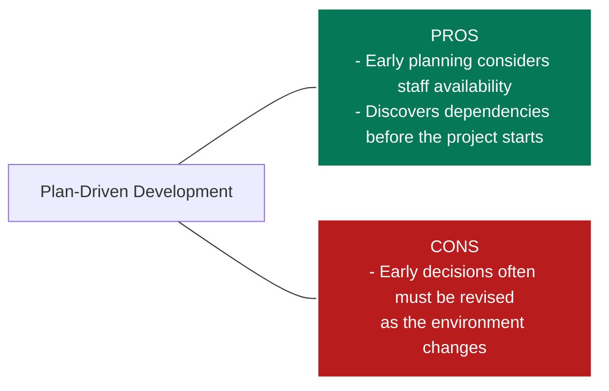

### Project Plan Sections & Supplements

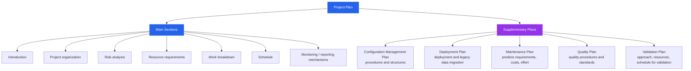

---

## 4. The Iterative Planning Process

**Concept:** Planning is iterative. Plans change because of requirements, schedules, risks, and shifting business goals. **Always include contingencies in your plans.**

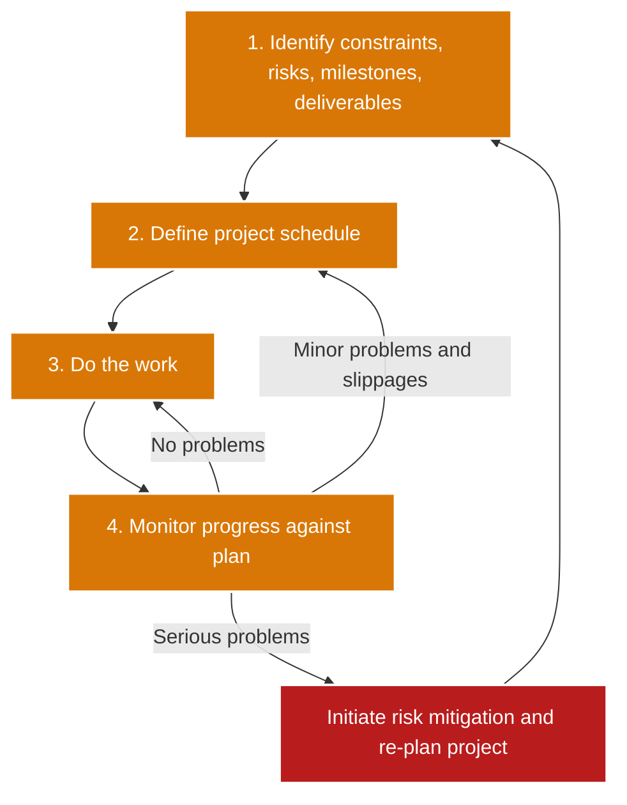

---

## 5. Project Scheduling

**Definition:** Deciding how work is organized into separate tasks, and estimating calendar time, effort, resources, and staffing.

### Scheduling Process

**Scheduling problems:**
- Productivity is **not** proportional to the number of staff.
- Adding people to a late project makes it **later**, because of communication overheads.

---

## 6. Activity Network Diagram & Critical Path

**Definition:** A diagram showing sequential relationships between activities using arrows and nodes, used to find the **critical path**: the longest sequence of activities, which determines the expected completion time.

### House Building Example

| Activity | Task | Duration |
|---|---|---|
| A | Excavate | 5 d |
| B | Foundation | 2 d |
| C | Frame | 12 d |
| D | Electrical | 9 d |
| E | Roof | 5 d |
| F | Masonry | 8 d |
| G | Interior | 10 d |
| H | Exterior | 7 d |
| I | Landscape | 5 d |

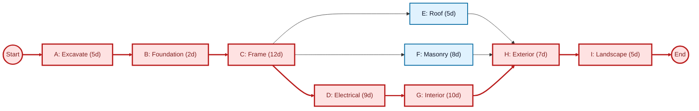

**Critical path:** START ➔ A ➔ B ➔ C ➔ D ➔ G ➔ H ➔ I ➔ END

**Total project duration:** 5 + 2 + 12 + 9 + 10 + 7 + 5 = **50 days**

Why not the other branches? After C, the three paths to H take:
- via D and G: 9 + 10 = **19 d** (longest, so critical)
- via F: 8 d
- via E: 5 d

**Critical rule:** Any delay to an activity on the critical path delays the entire project.

### Same project as a timeline (Gantt)

```mermaid
gantt
    title House Building Schedule (days from start)
    dateFormat  X
    axisFormat  Day %s

    section Critical path
    A Excavate       :crit, a, 0, 5
    B Foundation     :crit, b, after a, 2
    C Frame          :crit, c, after b, 12
    D Electrical     :crit, d, after c, 9
    G Interior       :crit, g, after d, 10
    H Exterior       :crit, h, after g, 7
    I Landscape      :crit, i, after h, 5

    section Non-critical (has slack)
    E Roof           :e, after c, 5
    F Masonry        :f, after c, 8
```

---

## 7. Time Estimation & Expected Time Formula

Each activity gets three estimates:

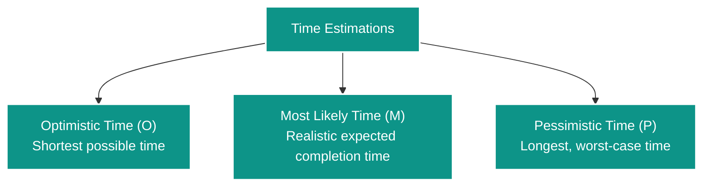

**Expected Time formula:**

$$\text{Expected Time} = \frac{O + 4M + P}{6}$$

**Worked example:** O = 2 days, M = 5 days, P = 14 days

Expected = (2 + 4 × 5 + 14) / 6 = 36 / 6 = **6 days**

Note how the expected time (6) is pulled above the most likely time (5) by the pessimistic estimate. The "4×" weight shows that the most likely value counts the most.

---

## 8. Ain Shams University Career Week (ASU CW 25)

**Organized by:** Ain Shams University, Banque Misr.

---

## 9. Quick Memory Cheat Sheet

| Topic | Remember this |
|---|---|
| 3 planning stages | **P**roposal → **S**tartup → **D**evelopment ("PSD") |
| 2 pricing strategies | Under-pricing (win/retain) vs. Increased pricing (risk buffer) |
| 5 price factors | **C**ontract, **E**stimate uncertainty, **F**inancial health, **M**arket opportunity, **R**equirements volatility ("CEFMR") |
| Plan-driven | Pro: dependencies found early. Con: decisions need revising |
| 5 supplementary plans | Configuration, Deployment, Maintenance, Quality, Validation |
| Iterative loop | Plan → Work → Monitor → (OK / minor: re-schedule / serious: re-plan) |
| 5 scheduling steps | Activities → Dependencies → Resources → People → Charts |
| Brooks's law (here) | Adding people to a late project makes it later |
| Critical path | The **longest** path = project duration (50 days in the house example) |
| Expected time | (O + 4M + P) / 6 |

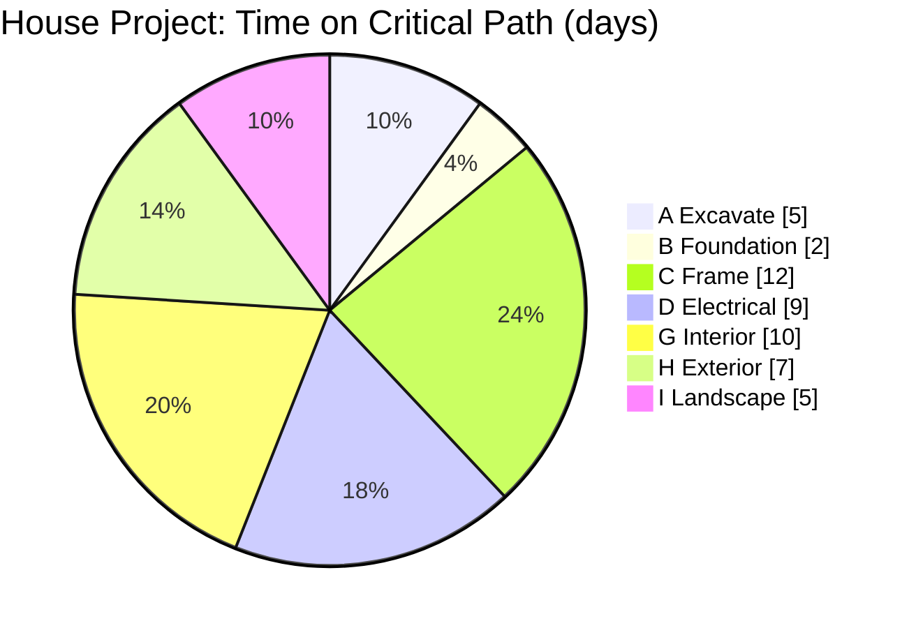
